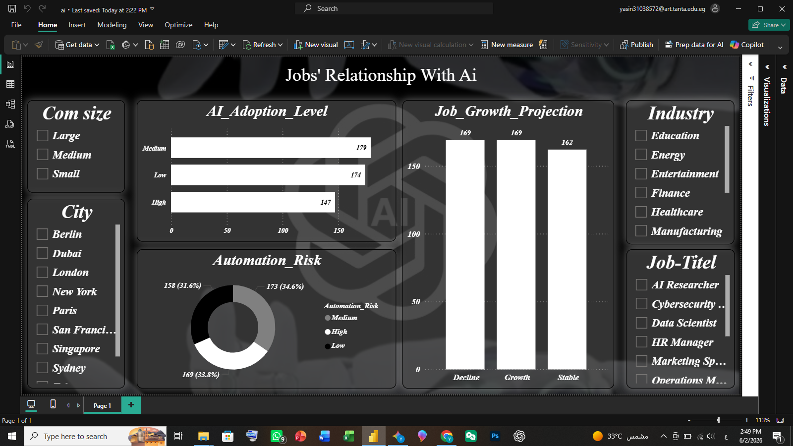

# AI-Adoption-Automation-Risk
# 🤖 AI Adoption & Automation Risk Analysis

## 📌 Project Overview
This Power BI dashboard provides a comprehensive analysis of how Artificial Intelligence and automation technologies are transforming the global job market. It highlights adoption rates across industries and evaluates the potential risk of displacement for various job roles.

## 📊 Key Insights & Features
* **AI Adoption Levels:** Tracks and visualizes high, medium, and low adoption rates across major global sectors.
* **Automation Risk Distribution:** A detailed assessment showing that over 34% of analyzed roles face a high risk of automation.
* **Job Growth Projections:** Predicts future workforce demands, classifying sectors into declining, stable, or growing domains.

## 🛠️ Tech Stack & Skills
* **Tool:** Power BI Desktop
* **Data Transformation:** Power Query (Data cleaning, type casting, and handling missing values)
* **Data Modeling:** Star Schema (Fact and Dimension tables)

## 📷 Dashboard Preview

